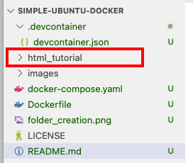
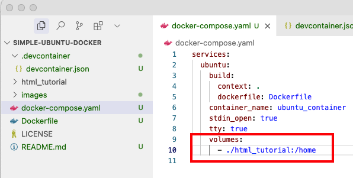
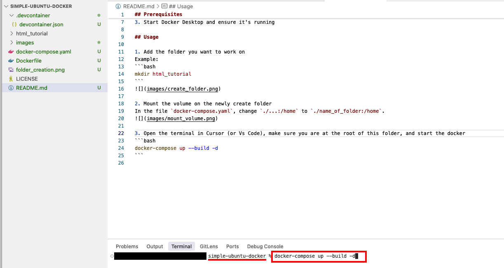
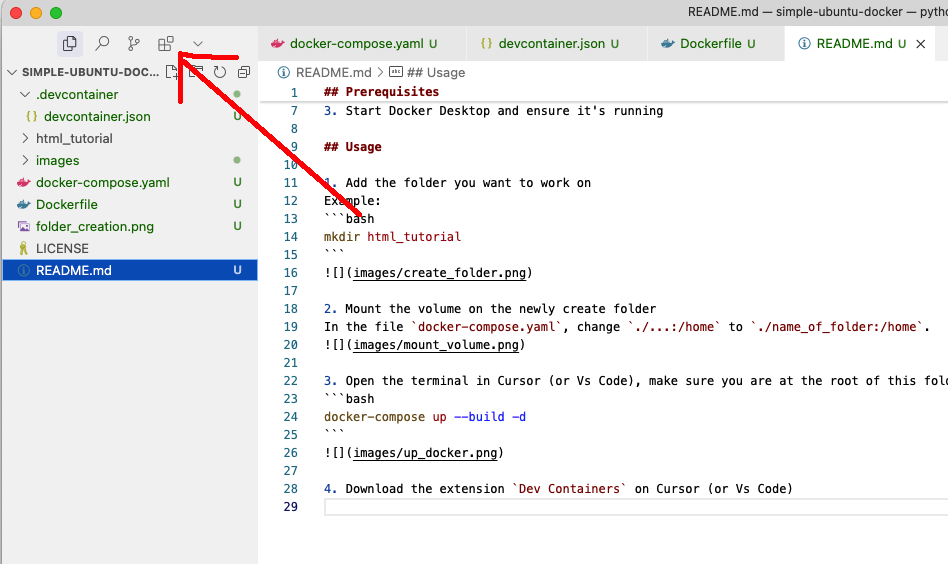
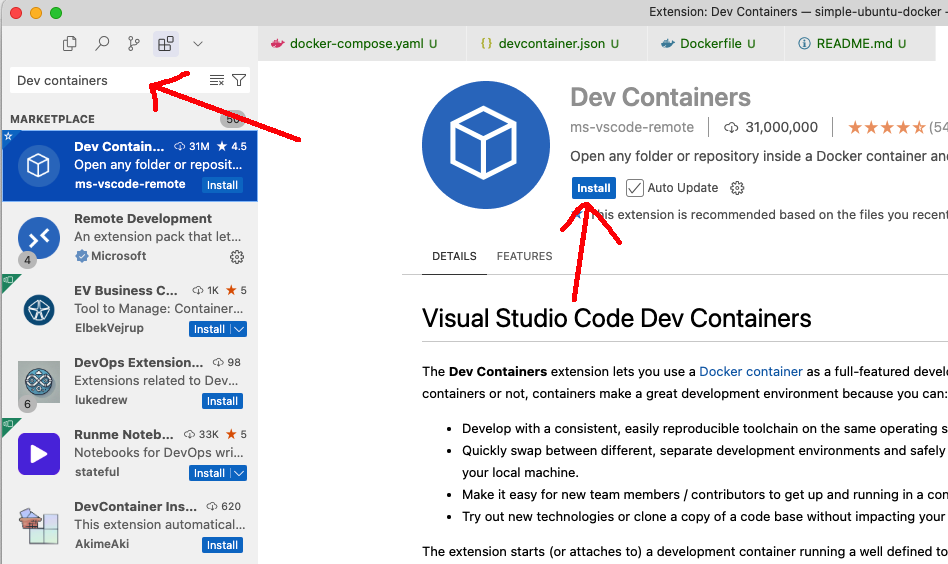
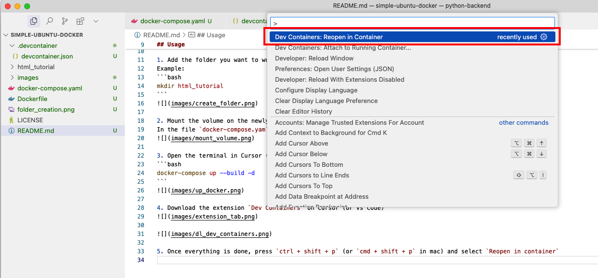
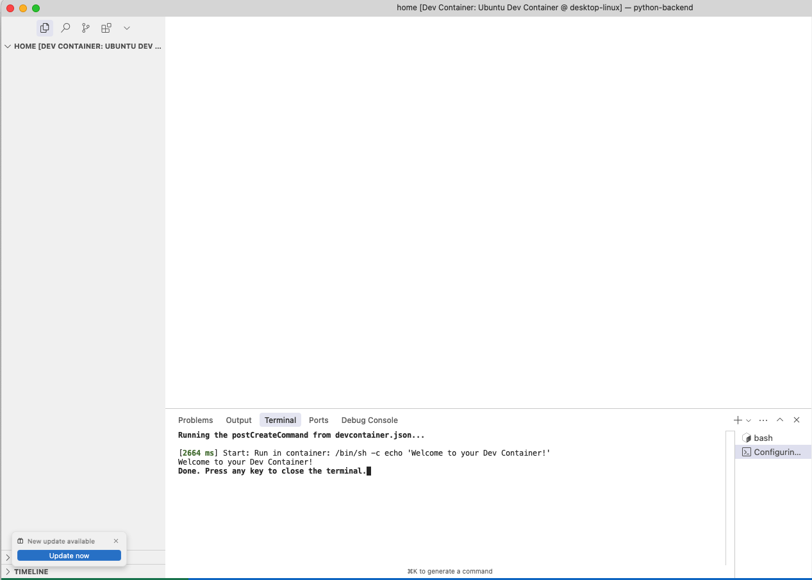
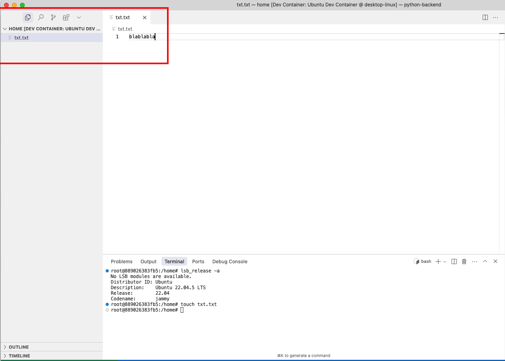
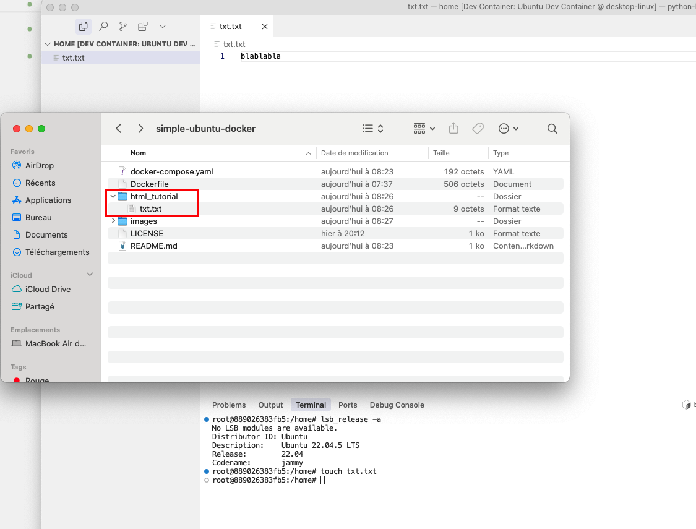

## Prerequisites

Before running the docker, you need to have Docker Desktop installed:

1. Download Docker Desktop from [https://www.docker.com/products/docker-desktop/](https://www.docker.com/products/docker-desktop/)
2. Install Docker Desktop following the installation instructions for your operating system
3. Start Docker Desktop and ensure it's running

## Usage

1. Add the folder you want to work on
Example:
```bash
mkdir html_tutorial
```


2. Mount the volume on the newly create folder
In the file `docker-compose.yaml`, change `./...:/home` to `./name_of_folder:/home`.


3. Open the terminal in Cursor (or Vs Code), make sure you are at the root of this folder, and start the docker
```bash
docker-compose up --build -d
```


4. Download the extension `Dev Containers` on Cursor (or Vs Code)




5. Once everything is done, press `ctrl + shift + p` (or `cmd + shift + p` in mac) and select `Reopen in container`


---

And Voilà, you have now Cursor (or VS Code) mounted on your local container. Whatever you are doing is executing on the docker environment,
but your files are saved locally to the folder you have created earlier. (Note that if it is not showing new files, it means something went wrong)






---

If you want to turn off your machine, it is better to down the docker before doing so,
```bash
docker-compose down
```

Note that when you will restart the docker
```bash
docker-compose up --build -d
```

It will still load your local files.